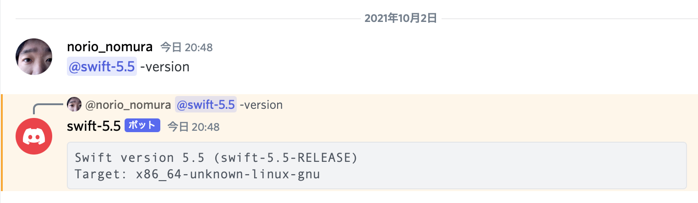

# Swift Compiler Discord Bot

Deploy a Discord bot that executes Swift CLI commands using [cli_discord_bot2](https://github.com/norio-nomura/cli_discord_bot2).

## Getting Started

### 1. Set Up a Discord Bot Account

Follow the [official guide](https://github.com/reactiflux/discord-irc/wiki/Creating-a-discord-bot-&-getting-a-token) to create a Discord bot and obtain a token.

**Required Permissions:**

- `CHANGE_NICKNAME` — to update the bot's nickname
- `READ_MESSAGE_HISTORY` and `VIEW_CHANNEL` — to update replies when users edit or delete messages

### 2. Invite the Bot to Your Server

Replace `<Client ID>` with your bot's Client ID and open the following URL in your browser:

```
https://discord.com/api/oauth2/authorize?client_id=<Client ID>&scope=bot&permissions=67174400
```


### 3. Run the Bot Locally with Docker Compose

```sh
export DISCORD_TOKEN="<discord token here>" # Discord bot token
docker compose up
```

### 4. Interact with the Bot

- Mention the bot in a message. The first code block in your message will be used as standard input.
- Lines mentioning the bot will be treated as CLI command arguments.
- The bot executes the CLI for each command line and replies with the results.
- If you edit or delete your mention, the bot will also edit or delete its replies.
- In DMs, the bot will reply without requiring a mention.




## Configuration


### Build-Time Configuration

#### Using the Official Docker Image

| Variable Name  | Description                                | Default         |
| -------------- | ------------------------------------------ | --------------- |
| `DOCKER_IMAGE` | Docker image that provides Swift on Ubuntu | `swift:jammy`   |

#### Using swift-DEVELOPMENT-SNAPSHOTS-* Tarball

| Variable Name   | Description                                 | Default                                |
| --------------- | ------------------------------------------- | -------------------------------------- |
| `SWIFT_WEBROOT` | Webroot for downloading Swift toolchain tar | https://download.swift.org/development |


### Environment Variables (Run-Time Configuration)

| Variable Name              | Description                            | Default            |
| -------------------------- | -------------------------------------- | ------------------ |
| `DISCORD_TOKEN`            | Discord bot token                      |                    |
| `DISCORD_NICKNAME`         | Discord nickname                       | Swift Version      |
| `DISCORD_PLAYING`          | Status for "Playing"                   | Tag in apple/swift |
| `ENV_COMMAND`              | Env command to launch target CLI       | `/usr/bin/env -i`  |
| `GITHUB_TOKEN`             | GitHub token (permission: public_repo) |                    |
| `TARGET_CLI`               | Target CLI                             | `swift`            |
| `TARGET_ARGS_TO_USE_STDIN` | Arguments for CLI with input           | `-`                |
| `TARGET_DEFAULT_ARGS`      | Arguments for CLI with no arguments    |                    |
| `TIMEOUT_SECONDS`          | Timeout (seconds) for CLI command      | `30`               |


### Example: Swift Compiler Bot

```sh
export DISCORD_TOKEN="<discord token here>" # Discord bot token
export DOCKER_IMAGE=swift:latest            # Docker image
docker compose up
```


## Author

Norio Nomura

## License

Swift Compiler Discord Bot is available under the MIT license. See the [LICENSE](LICENSE) file for more information.
